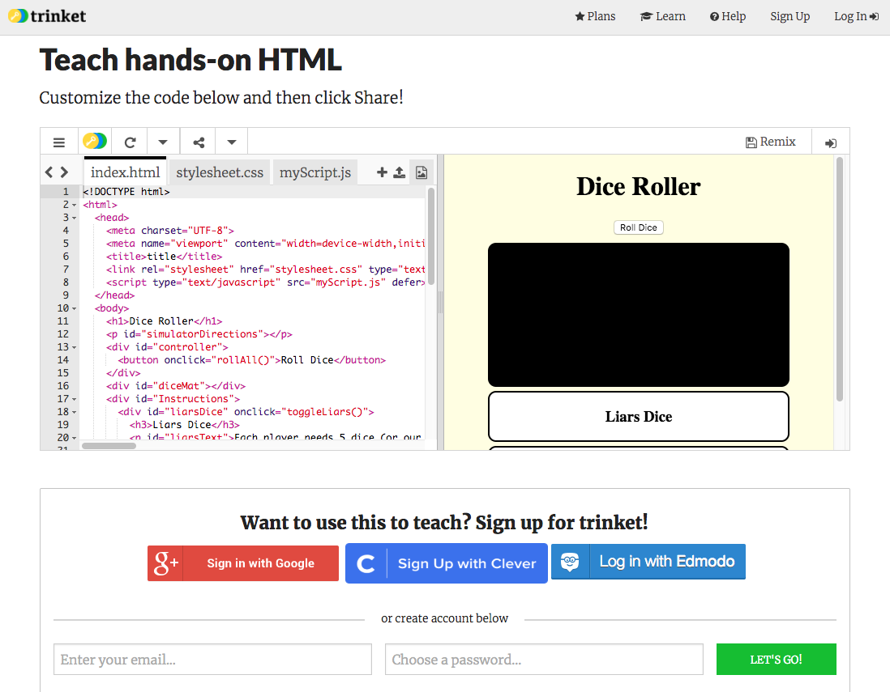

## Roll one die

First let's get set up on trinket.

--- task ---

Go to the [starter trinket here](https://trinket.io/html/830e255a5c){:target="_blank"}. You'll see a box containing an example website project. On the right-hand side is the website, and on the left-hand side is the code that makes the website. 



--- collapse ---
---
title: I have a trinket account
---

- Click the **Remix** button at the top right of the project. If you are not signed in, you will be prompted to do so. Once you've signed in, you'll  need to click  **Remix** again. Clicking this button creates a copy of the project for you to work with. 


It should say **remixed** after you click it:


--- /collapse ---

--- collapse ---
---
title: I don't have a trinket account
---

You can save your work by using one of the options in the **Share** menu. You will get a link that you can either save somewhere, for example in a document, or send to someone via email.
**Note:** each time you make a change, you will get a new link.

If you want to create an account on trinket, follow the steps below. This will allow you to access your work easily from any computer, and to **remix** projects somebody else has shared with you. Remixing means you will save a copy of a project so you can make your own changes to it.

- Go to [the trinket website](http://dojo.soy/trinket) and click **Sign Up For Your Free Account**. You will need an email address to sign up. 

- Enter your email address and choose a password, or ask somebody to do this for you.

- You can now access all your saved or remixed projects by clicking on your username and going to **My Trinkets**.


--- /collapse ---

--- /task ---

Now we're ready to begin coding!

--- task ---

In this project, I've supplied you with most of the HTML and CSS. You will mostly be working on the JavaScript code. This can be found in the JavaScript file `myScript.js` located just above the code on your screen. Before you roll a die, you will need to get access to the HTML `div` with the id `diceMat`. This is so you have somewhere to put the result of your roll on screen. Put the following line at the very top of your JavaScript code.

```javascript
    var diceMat = document.getElementById("diceMat");
```

This line of code will search our HTML `document` and look for the `element` with the id `diceMat`. Then it will store that element in the `variable` called diceMat.

[[[generic-javascript-create-variable]]]

--- /task ---

--- task ---

Next you need a `function` that will simulate a die roll. I have provided the function `dieRoll()` but I have left it blank so that you can fill it in.

```javascript
    function dieRoll(){
      return Math.floor(Math.random() * 6) + 1;
    }
```

There is a lot going on here, let's examine it further. 

[[[generic-javascript-create-a-function]]]

The `return` keyword in a function sends the value to the right of the word back to the point where the function was called. In this case, it is the code to get a random number between 1 and 6; i.e., the numbers on the faces of dice. `Math.random()` returns a random decimal number between 0 and 1 (inclusive of 0, but not 1). `Math.floor()` will round down the decimal number that is inside the `()`.

--- /task ---

--- task ---

To test your code, lets get that `Roll Dice` button to do something! If you click on the file called `index.html` above your code and look for the following line:

```html
    <button onclick="rollButton()">Roll Dice</button>
```

`rollButton()` is the function that is called when the button is pressed, let's code that function now! Go back the file `myScript.js` and add the following code in the `rollButton()` function:

```javascript
    function rollButton() {
      alert( "Your roll is " + dieRoll() );
    }
```

Now try and click on the button. You should get a pop up that tells you the value of your roll. Try it a couple of times and you should see that the number is random.

--- /task ---

--- task ---

Now we know our `dieRoll()` function works, let's get the result to appear on the dice mat. To do this lets rewrite our `rollButton()` function. Remember that we have our dice Mat stored in the variable `diceMat`!

```javascript
    function rollButton() {
        // alert( "Your roll is " + dieRoll() ); You can remove this line
        var rollValue = dieRoll();
        diceMat.style.color = "White";
        diceMat.style.fontSize = "150px";
        diceMat.innerHTML = rollValue;
    }
```

Here you have set the text `color` to white and the `fontSize` to 150 pixels (the little dots that make up our screens). You can change these to whatever you like to personalise your dice mat. Finally you have put the value for the die roll into the `diceMat`'s HTML so that you can see it. You can remove the alert becuse the pop up does get annoying after a while.

--- /task ---

You now have a working dice simulator. Click the button and you should see something like below. Lets see if you can make it look better in the next step.