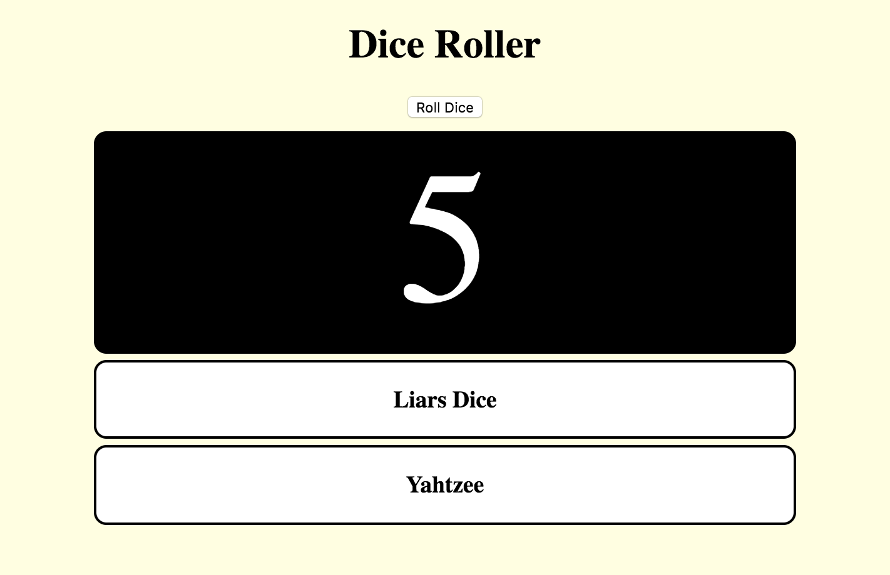

## Roll one die

First, get set up on Trinket.

--- task ---

Go to the [starter trinket here](https://trinket.io/html/11c523ad84){:target="_blank"}. You'll see a box containing an example website project. On the right-hand side is the website, and on the left-hand side is the code that makes the website. 


--- collapse ---
---
title: I have a Trinket account
---

- Click on the **Remix** button at the top right of the project. If you are not signed in, you will be prompted to do so. Once you are signed in, click on **Remix** again to create a copy of the project you can work with. 


The button should say **remixed** after you click it:


--- /collapse ---

--- collapse ---
---
title: I don't have a Trinket account
---

To save your work, click on the **Share** menu icon, and then click on **Link**. This creates a link you can copy and paste into a document, or send to someone by email.

**Note:** each time you make a change to your code, you get a new link.

If you want to create a free account on Trinket, follow the steps below. On a Trinket account, you can access your work easily from any computer, and you can also **remix** projects somebody else has shared with you. Remixing means that you save a copy of a project to make your own changes to it.

- Go to [the Trinket website](http://dojo.soy/trinket) and click on **Sign Up For Your Free Account**. You need an email address to sign up. 

- Enter your email address and choose a password, or ask somebody to do this for you.

- Click on your username and then click on **My Trinkets** to access all of your saved or remixed projects.


--- /collapse ---

--- /task ---

Now you're ready to start coding!

The starter trinket includes most of the HTML and CSS code already. You'll mainly work on the JavaScript code. Click on the `myScript.js` file name above the code window to access the JavaScript file.

Before you roll a die, you need to create a place to display the result of the roll. The place for the result is the HTML `div` with the id `diceMat`.

--- task ---

Put the following line of code at the very top of your JavaScript file.

```javascript
    var diceMat = document.getElementById("diceMat");
```

This code searches your HTML `document` for the `element` with the identifier `diceMat`. The code stores that element in the variable called `diceMat`.

[[[generic-javascript-create-variable]]]

--- /task ---

Next, create a function that simulates a die roll. An empty function called `dieRoll()` is already in the code.

--- task ---

Fill in the `dieRoll()` function with the following code.

```javascript
    function dieRoll(){
      return Math.floor(Math.random() * 6) + 1;
    }
```

--- /task ---

You can click on the following button to read about how to create a JavaScript function.

[[[generic-javascript-create-a-function]]]

This is what the function does:

+ The `return` keyword sends the value to its right back to the point where the function was called
+ `Math.floor(Math.random() * 6) + 1` is the code to get a random number between 1 and 6:
  + `Math.random()` returns a random decimal number between 0 and 1 (inclusive of 0, but not 1)
  + `Math.floor()` rounds down the decimal number that is inside the `()`
  + `1` is added so that the result is never `0` (rolling a die will never give you a `0`)

--- task ---

To test this function, you need to get the **Roll Dice** button to do something!

Click on the file name `index.html` above the code window and look for the following line:

```html
    <button onclick="rollButton()">Roll Dice</button>
```

`rollButton()` is the function that is called when you click the button. Write that function now!

Go back to the file `myScript.js` and add the following code **inside** the `rollButton()` function:

```javascript
    function rollButton() {
      alert( "Your roll is " + dieRoll() );
    }
```

Now click on the button. You should get a pop-up that displays the value of the roll. Click the button a few more times. You should see that the result is random.

--- /task ---

Now that you know the `dieRoll()` function works, you can make the result appear on the dice mat (the black rounded rectangle). 

--- task ---

To do this, rewrite your `rollButton()` function. Remember that the variable `diceMat` stores your dice!

```javascript
    function rollButton() {
        // alert( "Your roll is " + dieRoll() ); You can remove this line
        var rollValue = dieRoll();
        diceMat.style.color = "White";
        diceMat.style.fontSize = "150px";
        diceMat.innerHTML = rollValue;
    }
```

--- /task ---

This code sets the text `color` to white and the `fontSize` to 150 pixels (the little dots that make up images on computer screens). If you want to, you can change the look of the dice mat by changing `color` and `fontSize`. Finally, the code also displays value for the die roll in the `diceMat`'s HTML element. If you want to, you can remove the `alert` line.

You now have a working dice simulator! When you click the **Roll Dice** button, you should see something that looks like this: 



In the next step, you will make your simulator look even better. Later, you will also examine the **Liar's Dice** and **Yahtzee** boxes.
