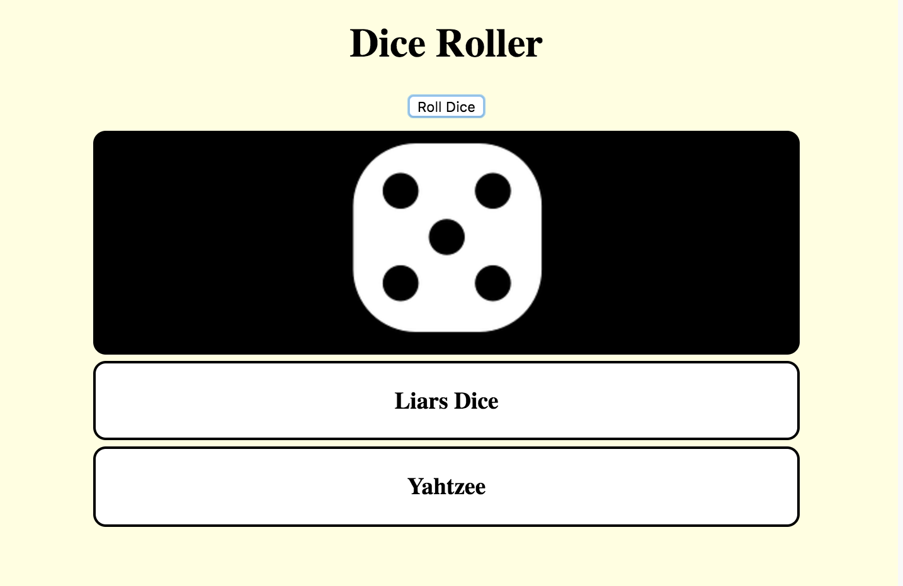

## Make the die faces look authentic

In this step, you're going to use images of real die faces instead of the number.

First, you need to make sure you have the images. If you're using Trinket, click on the image icon that is on the top right-hand side of the code editor. If you remixed the starter trinket, you should see the images called tile1.png, tile2.png etc. The images can also be found [here](https://github.com/raspberrypilearning/cd-dice-roller/tree/draft/en/images).

--- task ---

Next, you'll add to the `rollButton()` function again. You'll need to create an image element for your die face, set its source to the file names of your images (tile1.png, tile2.png etc), and then add or `append` the image to your dice mat. You can use the following lines of code to do that.

```javascript
    var image = document.createElement("img");
    image.src = ("tile" + rollValue + ".png");
    diceMat.appendChild(image);
```

--- /task ---

The image names are identical except for the number, so you can use concatenation and your `rollValue` variable to create the correct image name. 

[[[generic-javascript-concatenation]]]

You no longer need the lines that set the dice mat colour, size or inner HTML code, so you can delete them. However, when the `innerHTML` line is removed, the dice won't clear when you click the button, and they'll keep piling up.

--- task ---

There is an easy fix to this little problem. You just need to reset the diceMat HTML every time the button is clicked. If you add `diceMat.innerHTML = ""` at the start of the function, it will set the diceMat HTML to be empty. Your code should look like the below after this step. Pressing the button should produce a nice random image of a die face.

```javascript
    function rollButton() {
        diceMat.innerHTML = "";
        var rollValue = dieRoll();
        var image = document.createElement("img");
        image.src = ( "tile" + rollValue + ".png" );
        diceMat.appendChild(image);
    }
```

--- /task ---

If you are wondering what is causing the yellow colour to appear when you `hover` over the die, have a look at the `stylesheet.css` file and see if you can figure out what is causing it (change the colour too if you like!). 

One die is great, but what if we need two dice to play a game like Monopoly? Let's add an option for two dice in the next step! 


