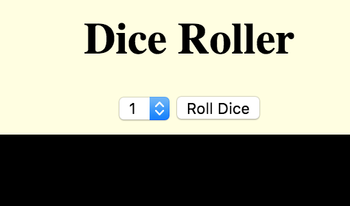
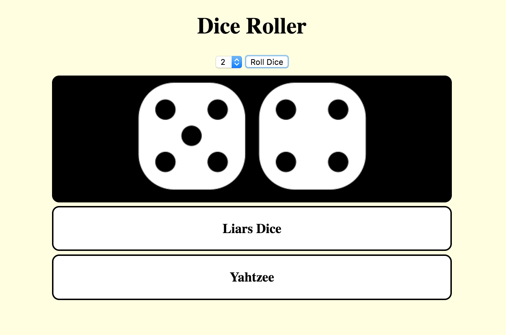

## Roll two dice

To create an option to roll two dice, you need to allow the user to choose if they want one or two dice. 

--- task ---

Go to your `index.html` file and find the `div` with the id `controller`. Add the following code inside this `div`.

```html
    <select id="selectDice">
        <option value="1">1</option>
        <option value="2">2</option>
    </select>
```

Note that this element has the id `selectDice`. Remember this id, as you are going to use it to write the next bit of code.

--- /task ---

A `select` drop-down menu should appear beside the button. The menu should have two options: 1 and 2. The user of your simulator can now choose the number of dice to roll.



Next, you need to get the number chosen in the `select` drop-down menu. This works in a similar way to how you put your dice mat in a variable. 

--- task ---

Add the following code to the top of your JavaScript file:

```javascript
    var diceNumberBox = document.getElementById("selectDice");
```

--- /task ---

--- task ---

Then, fill the `getNumDice()` function with this code:

```javascript
    function getNumDice() {
        return diceNumberBox.options[diceNumberBox.selectedIndex].value;
    }
```

--- /task ---

Now you can use the `getNumDice()` function to get the number chosen in the drop-down menu. If you want to test the `getNumDice()` function, you can use the `alert` command. Simply add the following line of code inside the `rollButton()` function: `alert(getNumDice());`

Rolling two dice requires you to learn about `for` loops. This is because you need to use the same code for both the first and the second dice.

--- collapse ---
---
title: Javascript `for` loops.
---

Loops are very useful when you need to repeat the same code over and over, with a different value each time. A `for` loop looks like this:

```javascript
    for (var i = 0; i < 10; i++) {
        youreCodeGoesHere();
    }
```

The first part, `var i = 0`, creates a **counting variable** and starts it at `0`. Next, the **condition**, `i < 10`  , indicates that the loop repeats the code for as long as `i` is less than `10`. Lastly, the **increment** statement runs **after** every time the code is repeated. `i++` means that `i` increases by `1` every time.

Therefore, this `for` loop repeats the code inside it 10 times.

--- /collapse ---

Your `for` loop has to run once for each die roll. This means you need the number chosen in the `select` drop-down menu. The function `getNumDice()` gives you that number.

--- task ---

Create your `for` loop by moving some of the existing code inside the loop's curly braces `{}`.

```javascript
    function rollButton() {
        diceMat.innerHTML = "";
        var numberOfDice = getNumDice(); //get the number of dice.
        for (var i = 0; i < numberOfDice; i++){ //create our for loop
            var rollValue = dieRoll();
            var image = document.createElement("img");
            image.src = ("tile" + rollValue + ".png");
            diceMat.appendChild(image);
        }
    }
```

--- /task ---


