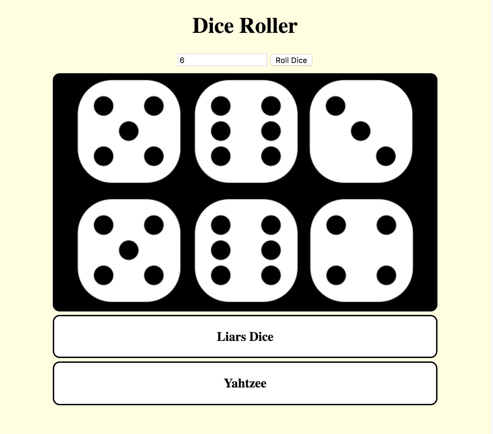

## Roll *n* dice

You can now play games like Monopoly because you can roll two dice, but some games, like Risk and Yahtzee, require more. Let's change your app so that you can roll any amount of dice, or *n* dice, as a mathematician would say!

--- task ---

First, replace your select box code in the `index.html` file with the following code that creates a `input` box that only allows numbers to be typed in. Keep the same ID though!

```html
    <div id="controller">

      <input type="number" id="selectDice" />

      <button onclick="rollButton()">Roll Dice</button>
    </div>
```

--- /task ---

--- task ---

Next, you need to edit your `getNumDice()` function. You can use the following code to get the value from the input box.

```javascript
    function getNumDice() {
        return return diceNumberBox.value;
    }
```

--- /task ---

That's all for this step! Your `for` loop condition used your `getNumDice()` function, so we don't need to make any changes to your `for` loop.


