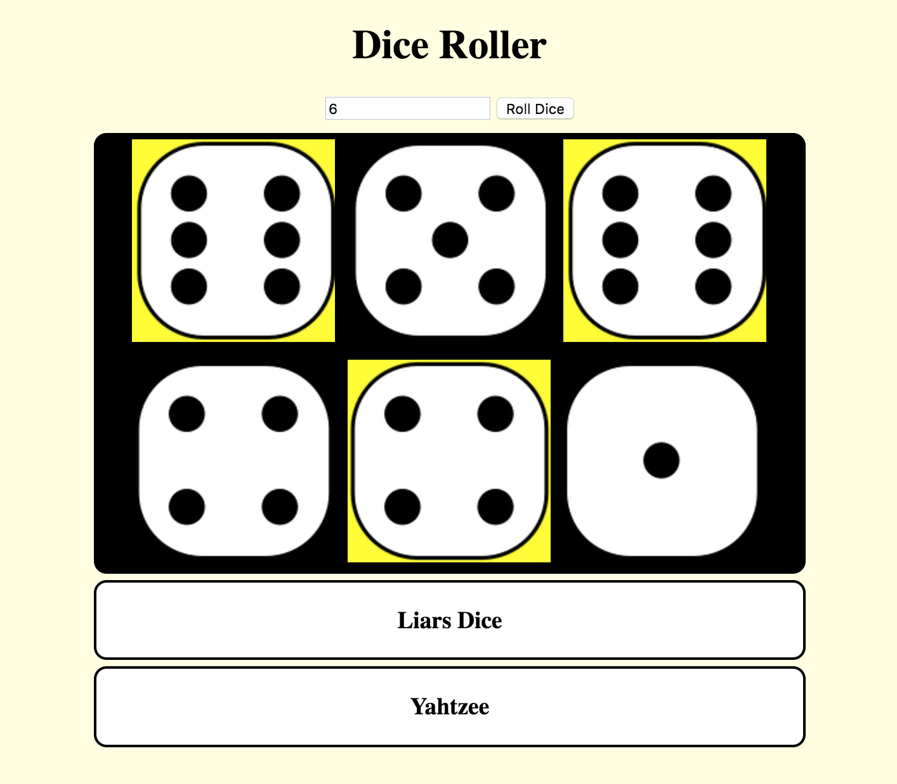

## Select individual dice

In this step you'll add toggle functionality to the dice. This will allow you to click on a die to change it's background colour to yellow (or whatever colour you like). You'll be able to click on it again to put it back to normal. This will be useful for lots of things one of which we will look at later in the project.

--- task ---

Firstly, you need to add two lines of code when you create your `img` tag in your `rollButton()` function. One to label each picture with an distinct ID and another to add an `onclick` function. 

```javascript
    for (var i = 0; i < numberOfDice; i++) { 
    var rollValue = dieRoll();
    var image = document.createElement("img");
    image.src = ("tile" + rollValue + ".png");

    //Two new lines below
    image.id = "dieNumber" + i;
    image.onclick = function() { toggleDieYellow(this.id); };

    diceMat.appendChild(image);
  }
```

--- /task ---

The onclick function will allow you to make the computer execute a function everytime you click the image. The onclick function is going to be `toggleDieYellow()` which you'll fill in shortly. You also need to use `this.id` as a **parameter** so that the function will toggle the correct die. A parameter is a variable that is passed into a function so that it can be used there.

--- task ---

To toggle our dice background colours you will need to create a CSS class that we can turn on and off. This class will have just one rule which should set the `background-color`. I used yellow you can choose whatever colour you would like. Be sure to add this code in the `stylesheet.css` file!

```css
  .selected {
    background-color: Yellow;
  }
```

--- /task ---

When creating a CSS selector, `.` is used to denote a class and `#` is used for id's.

--- task ---

Finally, let's focus on the `toggleDieYellow()` function. In the **function declaration**(The first line of a function), you'll see that unlike your other functions there is something between the **parenthesis**`()`. This is the parameter that you passed into the function at the start of this step! Now you can use the value from `this.id` in a new variable under the alias `dieID`. With this, getting your die element is easy and should look familiar. 

```javascript
  function toggleDieYellow(dieID) {
    var die = document.getElementById(dieID);
  }
```

--- /task ---

All that's left to do in this step is to toggle the CSS class you created, called `selected`.

--- task ---

 This can done by adding the following line of code!

```javascript
  function toggleDieYellow(dieID) {
    var die = document.getElementById(dieID);
    die.classList.toggle('selected');
  }
```

--- /task ---

Now if you click on a die it's background should be coloured yellow like below!

