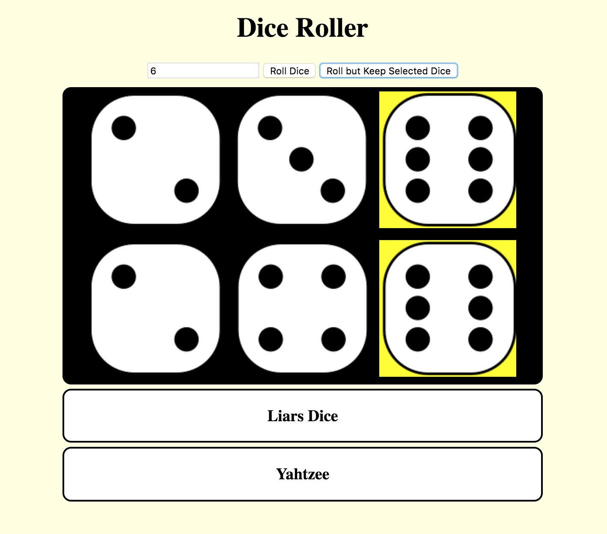
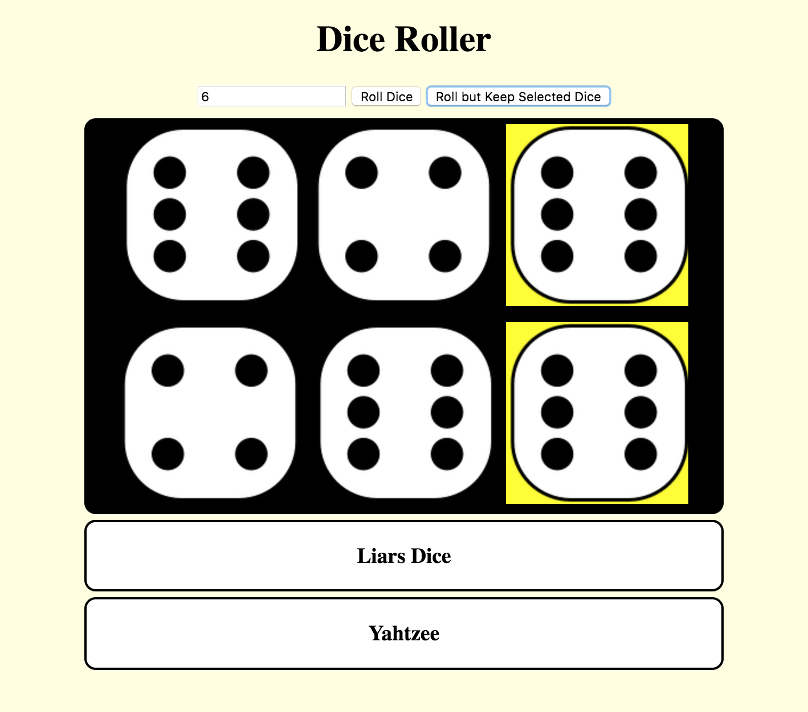

## Reroll the unselected dice

In this step you'll add the option to reroll the dice that the user has not selected, I.E. not turned yellow. This is a useful feature that is required for games like Yahtzee. You'll set up a second button to do this.

--- task ---

First, add a new button to the `index.html` file.

```html
    <div id="controller">
      <input type="number" id="selectDice" />
      <button onclick="rollButton()">Roll Dice</button>

      <button onclick="reRollUnselected()">Roll but Keep Selected Dice</button>

    </div>
```

It should have an `onclick` function that we will fill in next. You should see it opo up on the screen beside the first button!

--- /task ---

--- task ---

Let's start your function `reRollUnselected()` by gathering all the dice that have already been rolled. This can be done by getting all elements in the diceMat div.

```javascript
    function reRollUnselected(){
        var dice = document.getElementById('diceMat').children;
    }
```

This will save **all** our dice in one variable. This variable is like a list. A list is...
<!-- Mention similar to arrays and explain? Actually returns a HTMLCollection object -->

--- /task ---

--- task ---

Next you must use a `for` loop to check if every die is selected or not. Your for loop should go from 0 up to the size of the list. You can use the `.length` function to get this value. Then you need to use an `if` statement to check if die in position `i` is **not selected**, as these are the dice that we need to reroll. Finally use your `dieRoll()` function and update the `src` property of the dice at `i`. There is a lot in this task, but on completion your function should look like the following:

```javascript
    function reRollUnselected(){
        var dice = document.getElementById('diceMat').children;

        for (var i = 0; i < dice.length; i++){
            if(dice[i].classList.contains('selected') == false){//if unselected, reroll
                var roll = dieRoll();
                dice[i].src = ("tile" + roll + ".png");
            }
        }

    }
```

--- /task ---

Now you should be able to select some dice and if you click the new button it should save the selected dice and reroll the others. Below I select my sixes from the first roll and reroll the others to try and get some more!

Select Dice             |  Reroll but keep selected dice
:-------------------------:|:-------------------------:
  |  