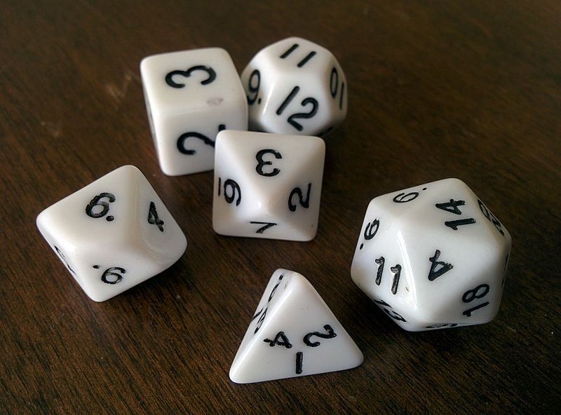
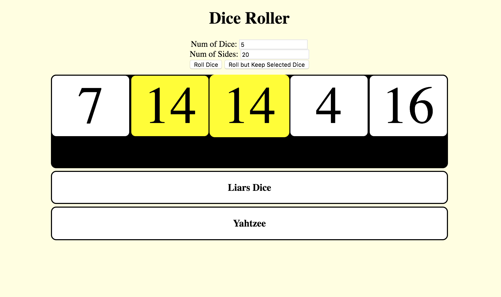

--- challenge ---

## Challenge: dice with more than six sides

Some games like Dungeons and Dragons have unique dice that are not cubes and may have more or less than six sides. Edit your Dice Roller so that the user can select the number of sides that the dice will have. (Don't worry about using the dice images, just use the actual numbers like you did at the start of the project.)



--- hints ---

--- hint ---

To complete this challenge, you'll need to change how you display your dice. Since you don't have images for sides that need to show numbers greater than 6, just use numbers like we did at the beginning of the project. If you put them inside a `div` element, it will make it easier to keep your reroll function working. Go back and look at the **Roll one die** step for help. A CSS class called `.textDice` is included to help you style the new divs.

--- /hint ---

--- hint ---

Create `div` elements instead of images in your `for` loop inside your`rollButton()` function. Use `.innerHTML` instead of an image `src`. If you want to use the `.textDice` style, include the line `elem.classList.add('textDice');`.

```javascript
    function rollButton() {
        diceMat.innerHTML = "";
        var numberOfDice = getNumDice();
        for (var i = 0; i < numberOfDice; i++) {
            var rollValue = dieRoll();
            var elem = document.createElement("div");
            elem.innerHTML = (rollValue);
            elem.id = "dieNumber" + i;
            elem.classList.add('textDice');    
            elem.onclick = function() { toggleDieYellow(this.id); };
            diceMat.appendChild(elem);
        }
        var clearDiv = document.createElement("div");
        clearDiv.style.clear="both";
        diceMat.appendChild(clearDiv);
    }
```

The last three lines are used to clear the float property that was introduced in the CSS class `.textDice`. If you are not using it, you might not need these!

--- /hint ---

--- hint ---

Finally, introduce another way to collect input from the user to query how many sides they would like their dice to have. You could use a select box or another input with the property `type="number"`.

```html
<div id="controller">
      Num of Dice: <input type="number" id="selectDice" /> <br>
      Num of Sides: <input type="number" id="selectSides" /> <br>
      <button onclick="rollButton()">Roll Dice</button>
      <button onclick="reRollUnselected()">Roll but Keep Selected Dice</button>
</div>
```

```javascript
    //This gets your new input box
    var diceSidesBox = document.getElementById("selectSides");

    //Swap the number 6 for diceSidesBox.value to only get the correct numbers
    function dieRoll(){
        return Math.floor(Math.random() * diceSidesBox.value) + 1;
    }
```

--- /hint ---

--- /hints ---

--- /challenge ---


